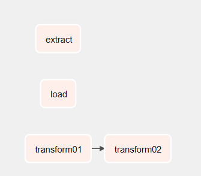
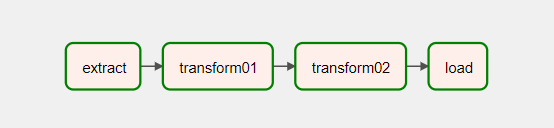

# tutorial01 建立依赖关系

# tutorial02 建立依赖关系

# tutorial03 在装饰任务和传统任务之间添加依赖关系
# tutorial004 在装饰任务和传统任务之间使用 XCom
# tutorial005 在装饰任务中访问上下文变量
# tutorial006 学习 BashOperator
# tutorial007 学习 Airflow 变量
# tutorial008 学习 任务依赖
# tutorial009 学习 任务依赖
# tutorial010 学习 任务依赖
# tutorial011 学习 任务依赖
# tutorial012 学习 BranchPythonOperator
# tutorial013 学习 LatestOnlyOperator
# tutorial014 练习 触发规则
# tutorial015 练习 动态 DAG
# tutorial016 练习 TaskGroup
# tutorial017 测试不明确指定依赖关系
# tutorial018 练习 Edge Labels(边缘标签)
# tutorial019 练习 DAG 和 TASK 注释文档
# tutorial020 练习 SLAs
# tutorial021 练习 TaskFlow
